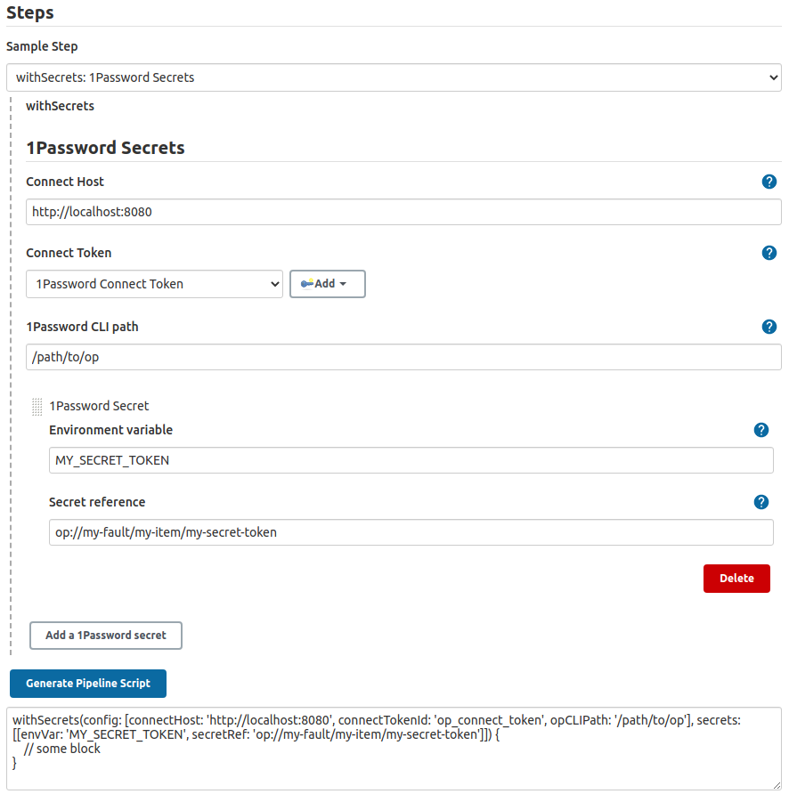

1Password Secrets plugin for Jenkins
============================

This plugin loads secrets from [1Password Connect](https://1password.com/secrets/) as environment variables into the Jenkins pipeline. The loaded secrets can only be accessed witin the scope of the plugin.

## Prerequisites
- [1Password Connect](https://support.1password.com/secrets-automation/#step-2-deploy-a-1password-connect-server) deployed in your infrastructure

## Install the 1Password CLI

This plugin relies on the 1Password CLI. Therefore, you can install it on your host by running the following script:
```shell
curl -sSfLo op.zip https://cache.agilebits.com/dist/1P/op2/pkg/v2.7.2/op_linux_amd64_v2.7.2.zip
unzip -o op.zip
rm op.zip
```

If installed within the same pipeline, you need to add the script before any call to the plugin.

```groovy
pipeline {
    agent any
    stages {
        stage('Install 1Password CLI') {
            sh '''
            curl -sSfLo op.zip https://cache.agilebits.com/dist/1P/op2/pkg/v2.7.2/op_linux_amd64_v2.7.2.zip
            unzip -o op.zip
            rm op.zip
            '''
        }
        stage('you can make calls to the 1Password plugin here') {
            // add what to do in this stage
        }
    }
}
```

<details>
<summary><b>Scripted Jenkinsfile</b></summary>

```groovy

node {
    stage('Install 1Password CLI') {
        sh '''
        curl -sSfLo op.zip https://cache.agilebits.com/dist/1P/op2/pkg/v2.7.2/op_linux_amd64_v2.7.2.zip
        unzip -o op.zip
        rm op.zip
        '''
    }
    stage('you can make calls to the 1Password plugin here') {
        // add what to do in this stage
    }
}
```

</details>

If installed in a separate build, you need to set the `1Password CLI path` to the workspace where the installation was made in your [config](#configuration).

<details>
<summary><b> Example installation via Freestyle Project</b></summary>


</details>

<details>
<summary><b>Example installation via pipeline script</b></summary>

*Declarative Jenkinsfile*

```groovy
pipeline {
    agent any
    stages {
        stage('Install 1Password CLI') {
            sh '''
            curl -sSfLo op.zip https://cache.agilebits.com/dist/1P/op2/pkg/v2.7.2/op_linux_amd64_v2.7.2.zip
            unzip -o op.zip
            rm op.zip
            '''
        }
    }
}
```

<details>
<summary><i>Scripted Jenkinsfile</i></summary>

```groovy
node {
    stage('Install 1Password CLI') {
        sh '''
        curl -sSfLo op.zip https://cache.agilebits.com/dist/1P/op2/pkg/v2.7.2/op_linux_amd64_v2.7.2.zip
        unzip -o op.zip
        rm op.zip
        '''
    }
}
```
</details>
</details>

## Plugin usage

### Configuration

You can configure the plugin on three different levels:
- Global: in your global config
- Folder-level: on the folder your job is running in
- Job level: either on your freestyle project job or directly in the Jenkinsfile

The lower the level the higher its priority, meaning: if you configure a Connect host in your global settings, but override it in your particular job, then the Connect host configured at the job level will be used. In your configuration (may it be global, folder or job) you see the following screen:


You can configure the following:
- `Connect Host`: the host where Connect has been deployed
- `Connect Credential`: a `Secret text` credential type that contains the 1Password Connect Token to get secrets from 1Password
- `1Password CLI path`: path to the 1Password CLI binary

This image below shows how to create the Connect Credential:


### Usage in Freestyle Jobs

If you still use free style jobs (hint: you should consider migrating to [Jenkinsfile](https://jenkins.io/doc/book/pipeline/)), you can set up both the [config](#configuration) and the secrets you need on the job level.


For adding a secret, you can press the `Add a 1Password secret` and then complete the following fields:
- `Environment variable` - the name of the environment variable that will contain the loaded secret
- `Secret reference` - the 1Password secret reference in format `op://<vault>/<item>[/section]/<field>`

The secrets are available as environment variables.

### Usage via Jenkinsfile

To be able to use the secrets within the pipeline, you need to use the function `withSecrets`, which as parameters gets the config and the list of secrets to be loaded form 1Password.

```groovy
// (Optional) Define the configuration values for your Connect Instance.
// If no configuration provided, a more broadly scoped configuration will be used (e.g. folder or global). 
// Note the most granularly scoped configuration will have priority over all other configurations.
def config = [
        connectHost: 'http://localhost:8080', 
        connectCredentialId: 'my-connect-credential-id',
        opCLIPath: '/path/to/op'
]

// Define the environment variables that will have the values of the secrets
// read using the secret reference `op://<vault>/<item>[/section]/<field>`
def secrets = [
    [envVar: 'DOCKER_USERNAME', secretRef: 'op://vault/item/username'],
    [envVar: 'DOCKER_PASSWORD', secretRef: 'op://vault/item/password']
]

pipeline {
    agent any
    stages{
        stage('Push latest docker image') {
            steps {
                // Environment variables will be set with the secrets specified by
                // the secret references within this block only.
                withSecrets(config: config, secrets: secrets) {
                    docker.withRegistry('http://somehost:5100') {
                        sh 'docker login -u ${DOCKER_USERNAME} -p ${DOCKER_PASSWORD} http://somehost:5100'
                        def	image = docker.build('somebuild')
                        image.push 'latest'
                    }
                }
            }
        }
    }
}
```

<details>
<summary><b> Scripted Jenkinsfile</b></summary>

```groovy
node {
    // (Optional) Define the configuration values for your Connect Instance.
    // If no configuration provided, a more broadly scoped configuration will be used (e.g. folder or global). 
    // Note the most granularly scoped configuration will have priority over all other configurations.
    def config = [
        connectHost: 'http://localhost:8080', 
        connectCredentialId: 'my-connect-credential-id',
        opCLIPath: '/path/to/op'
    ]

    // Define the environment variables that will have the values of the secrets
    // read using the secret reference `op://<vault>/<item>[/section]/<field>`
    def secrets = [
        [envVar: 'DOCKER_USERNAME', secretRef: 'op://vault/item/username'],
        [envVar: 'DOCKER_PASSWORD', secretRef: 'op://vault/item/password']
    ]
    
    stage('Push latest docker image') {
        // Environment variables will be set with the secrets specified by 
        // the secret references within this block only.
        withSecrets(config: config, secrets: secrets) {
            docker.withRegistry('http://somehost:5100') {
                sh 'docker login -u ${DOCKER_USERNAME} -p ${DOCKER_PASSWORD} http://somehost:5100'
                def image = docker.build('somebuild')
                image.push 'latest'
            }
        }
    }
}
```
</details>

Whenever in doubt, you can use the `Pypeline Syntax` helper from Jenkins.



### Usage with environment variables

This plugin also enables you to get the config and the secrets from environment variables.

For the config, you need to set up `OP_CONNECT_HOST`, `OP_CONNECT_TOKEN`, and `OP_CLI_PATH` as environment variables.

```groovy
pipeline {
    agent any
    environment {
        // (Optional) Define the configuration values for your Connect Instance as environment variables.
        // If no configuration provided, a more broadly scoped configuration will be used (e.g. folder or global). 
        // Note the most granularly scoped configuration will have priority over all other configurations.
        OP_CONNECT_HOST = 'http://localhost:8080'
        OP_CONNECT_TOKEN = credentials('my-connect-credential-id')
        OP_CLI_PATH = '/path/to/op'

        // Define the environment variables that will have the values of the secrets
        // read using the secret reference `op://<vault>/<item>[/section]/<field>`
        DOCKER_USERNAME = 'op://vault/item/username'
        DOCKER_PASSWORD = 'op://vault/item/password'
    }
    stages{
        stage('Push latest docker image') {
            steps {
                // Environment variables will be set with the secrets specified by 
                // the secret references within this block only.
                withSecrets() {
                    docker.withRegistry('http://somehost:5100') {
                        sh 'docker login -u ${DOCKER_USERNAME} -p ${DOCKER_PASSWORD} http://somehost:5100'
                        def	image = docker.build('somebuild')
                        image.push 'latest'
                    }
                }
            }
        }
    }
}
```

<details>
<summary><b> Scripted Jenkinsfile</b></summary>

```groovy
node {
    def environment = [
        // (Optional) Define the configuration values for your Connect Instance as environment variables.
        // If no configuration provided, a more broadly scoped configuration will be used (e.g. folder or global). 
        // Note the most granularly scoped configuration will have priority over all other configurations.
        'OP_CONNECT_HOST=http://localhost:8080',
        'OP_CLI_PATH = /path/to/op',

        // Define the environment variables that will have the values of the secrets
        // read using the secret reference `op://<vault>/<item>[/section]/<field>`
        'DOCKER_USERNAME=op://vault/item/username',
        'DOCKER_PASSWORD=op://vault/item/password'
    ]

    def credentials = [
        string(credentialsId: 'my-connect-credential-id', variable: 'OP_CONNECT_TOKEN')
    ]
    
    withEnv(environment) {
        withCredentials(credentials) {
            stage('Push latest docker image') {
                // Environment variables will be set with the secrets specified by 
                // the secret reference within this block only.
                withSecrets() {
                    docker.withRegistry('http://somehost:5100') {
                        sh 'docker login -u ${DOCKER_USERNAME} -p ${DOCKER_PASSWORD} http://somehost:5100'
                        def image = docker.build('somebuild')
                        image.push 'latest'
                    }
                }
            }
        }
    } 
}
```
</details>

See the [examples](./docs/examples) directory for more examples and use cases.

## Requirements:
* Maven > 3.3.9
* Oracle JDK 11

## Security

1Password requests you practice responsible disclosure if you discover a vulnerability.

Please file requests via [**BugCrowd**](https://bugcrowd.com/agilebits).

For information about security practices, please visit our [Security homepage](https://bugcrowd.com/agilebits).

## Getting help

If you find yourself stuck, visit our [**Support Page**](https://support.1password.com/) for help.

<!--
# onepassword-secrets

## Introduction

TODO Describe what your plugin does here

## Getting started

TODO Tell users how to configure your plugin here, include screenshots, pipeline examples and 
configuration-as-code examples.

## Issues

TODO Decide where you're going to host your issues, the default is Jenkins JIRA, but you can also enable GitHub issues,
If you use GitHub issues there's no need for this section; else add the following line:

Report issues and enhancements in the [Jenkins issue tracker](https://issues.jenkins-ci.org/).

## Contributing

TODO review the default [CONTRIBUTING](https://github.com/jenkinsci/.github/blob/master/CONTRIBUTING.md) file and make sure it is appropriate for your plugin, if not then add your own one adapted from the base file

Refer to our [contribution guidelines](https://github.com/jenkinsci/.github/blob/master/CONTRIBUTING.md)

## LICENSE

Licensed under MIT, see [LICENSE](LICENSE.md)
-->
